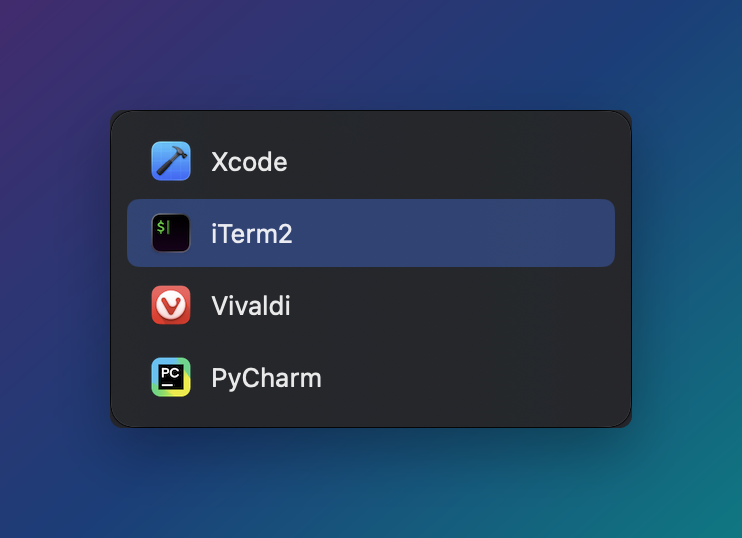

# BareTab

<p align="center">
  
</p>

Minimal native MacOS window switcher designed to keep you in flow. Hold **Command**, press **Tab** to cycle
through the windows on the current desktop and the display under the pointer. **Shift-Tab** cycles backward, **Escape**
cancels, and **Q** twice within two seconds closes the highlighted window. To cycle through windows on
every display instead, turn on **Include All Displays** in the menu bar icon's menu. **Group by Display** then lists
them under a heading per display.

While the switcher is open, **Up** and **Down** move the highlight, **Left** and **Right** jump between displays
when grouped, and **Return** switches right away without waiting for Command to be released.

If someone stumbles across this and would like a feature added, feel free to create an issue and I will add it within a day.
I will not be adding window previews.

## Install

Requires macOS 13 or later. No Swift or Xcode needed.

**Homebrew**

```sh
brew install --cask marcusmalloc/tap/baretab
```

**Manual**

1. Download `BareTab-<version>.zip` from the [latest release](https://github.com/marcusmalloc/alt-tab-macos-but-free/releases/latest) and unzip it.
2. Move `BareTab.app` to `/Applications`.
3. The app is not notarized, so macOS will refuse to open it the first time. Clear the quarantine flag:

   ```sh
   xattr -dr com.apple.quarantine /Applications/BareTab.app
   ```

4. Open BareTab and grant it Accessibility access when prompted
   (System Settings > Privacy & Security > Accessibility). Without it, Command-Tab cannot be intercepted.

Because there is no Apple Developer signature, macOS may ask you to grant Accessibility access again after upgrading.

## Build from source

```sh
scripts/run.sh            # debug build, then launch
scripts/release.sh 0.1.0  # universal release build zipped into dist/
```

Only the Xcode Command Line Tools are required. Pushing a `v*` tag builds the release on GitHub Actions and
publishes the zip and its checksum to a GitHub Release.

MIT licensed. See [LICENSE](LICENSE).
